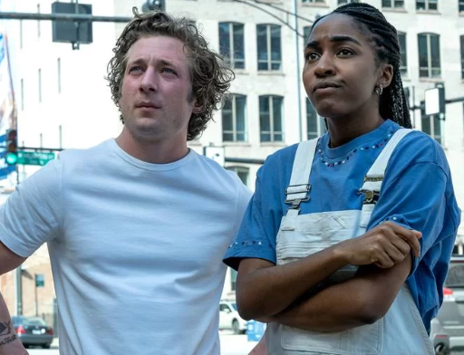

    <article class="row row-cols-1 row-cols-md-2 g-4">
        

            <h5 class="card-title">O ator vegano joaquin phoenix que interpretou coringa diz que não aguentaria uma semana sendo a lady gaga </h5>
            
                
“13 anos sem hit solo... uma piada!”

                <a href="noticia1.html"><button>Leia mais aqui</button></a>
        

        
        
        
            <h5 class="card-title">"Bottoms", "Succession" e "The Bear" vencem a noite dos SAG Awards</h5>
            
            
“Na televisão, as séries “Succession” e “The Bear” foram as mais galardoadas”

            <a href="noticia2.html"><button>Leia mais aqui</button></a>
        

        
        
        
            
            <h1>O tema do “act 2” de Beyoncé é country!</h1>
            
“Além de inovar, performar e não ser desesperada por charts beyoncé agora é do country”

            <a href="noticia3.html"><button>Leia mais aqui</button></a>
            
        

        
        
        
            
            <h1>"The white lotus", "Marte Um", "The Bear" e outras produções que mereciam mais atenção</h1>
            
“elegemos os filmes e séries que foram deixados de lado, mas mereciam muito mais”

            <a href="noticia4.html"><button>Leia mais aqui</button></a>    
        

        
    </article>